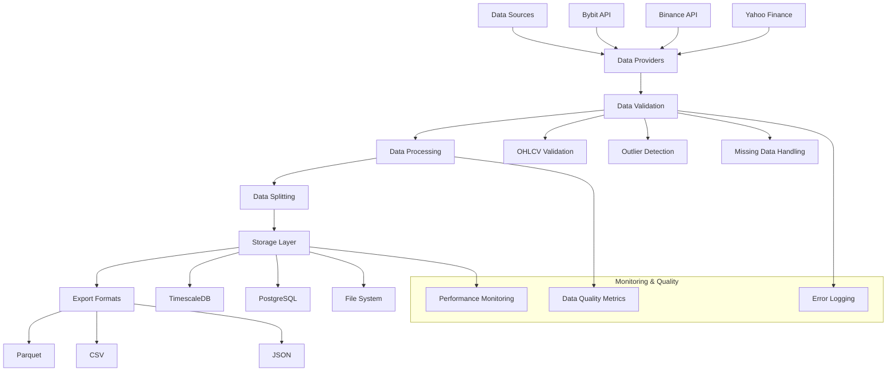

# Financial Data Pipeline 📊

[](https://github.com/thedatawithjose/Financial-Data-Pipeline/actions/workflows/ci.yml)
[](https://codecov.io/gh/thedatawithjose/Financial-Data-Pipeline)
[](https://github.com/thedatawithjose/Financial-Data-Pipeline/stargazers)
[](LICENSE)

A modular, enterprise‑grade ETL pipeline for financial market data. It supports **extraction**, **transformation**, **validation** and **storage** from multiple sources (crypto, equities, derivatives) with advanced analytics and database integration. Designed with data contracts and monitoring in mind, this project gives you reproducible pipelines with cost and quality controls. See the full documentation below for setup, validation, data splits and extension points.

<!-- Optionally embed a demonstration GIF here to visualise pipeline execution and monitoring

-->


[](https://codecov.io/gh/josetraderx/Financial-Data-Pipeline)

## Table of Contents
1. [Overview](#overview)
2. [Requirements](#requirements)
3. [5-Minute Quick Start](#5-minute-quick-start)
4. [Architecture](#architecture)
5. [Key Features](#key-features)
6. [Installation & Setup](#installation--setup)
7. [Configuration](#configuration)
8. [Data Validation](#data-validation)
9. [Data Storage](#data-storage)
10. [Data Splitting](#data-splitting)
11. [Monitoring and Quality Assurance](#monitoring-and-quality-assurance)
12. [Error Handling](#error-handling)
13. [Performance Optimization](#performance-optimization)
14. [Testing](#testing)
15. [Examples](#examples)
16. [Extension Points](#extension-points)
17. [FAQ](#frequently-asked-questions-faq)
18. [Troubleshooting](#troubleshooting)
19. [Contributing](#contributing)
20. [License](#license)

## Overview

Exodus v2025 is a professional and modular ETL pipeline for financial data (crypto, stocks, derivatives), with advanced validation, splits, storage in TimescaleDB/PostgreSQL, and export to Parquet/CSV/JSON files.

## Requirements

- **Python**: >=3.8
- **Poetry** (recommended) or pip for dependency management
- **PostgreSQL** and **TimescaleDB** for database storage (if using DB features)
- **pytest** for running tests

## 5-Minute Quick Start

### Option 1: Terminal Quick Start (No Code Required)
```bash
# 1. Clone and setup
git clone https://github.com/josetraderx/Financial-Data-Pipeline.git
cd Financial-Data-Pipeline
pip install -r requirements.txt

# 2. Download Bitcoin data for the last 7 days (1-hour intervals)
python -m Data_ETL.cli download --symbol BTCUSDT --timeframe 1h --days 7

# 3. View your data
ls data/processed/  # Your CSV files are here!
```

### Option 2: Python Quick Start (3 Lines of Code)
```python
from Data_ETL.pipelines.crypto_pipeline import CryptoPipeline

# Download and process Bitcoin data
pipeline = CryptoPipeline()
data = pipeline.quick_download('BTCUSDT', timeframe='1h', days=7)
print(f"✅ Downloaded {len(data)} Bitcoin price records!")
```

**Expected Output:**
```
✅ Downloaded 168 Bitcoin price records!
   Timestamp         Open     High      Low    Close      Volume
0  2024-08-04 00:00  65420.5  65580.0  65200.0  65350.2  1250.43
1  2024-08-04 01:00  65350.2  65480.1  65180.5  65420.8  980.52
...
```

### Option 3: One-Liner with File Export
```python
# Download data and save to CSV in one line
CryptoPipeline().quick_download('ETHUSDT', '4h', 14).to_csv('ethereum_2weeks.csv')
```

## Architecture

### System Flow Diagram


### Project Structure
```
Data_ETL/
├── providers/          # Data provider implementations
│   ├── crypto/         # Cryptocurrency data providers
│   ├── equities/       # Stock market data providers
│   ├── options/        # Options data providers
│   └── other_derivatives/  # Other derivative instruments
├── processing/         # Data processing and validation
│   ├── enhanced_metadata_manager.py  # Centralized metadata management
│   ├── data_cleaner.py              # Data validation and cleaning
│   └── data_splitter.py             # Data splitting utilities
├── storage/            # Database storage solutions
│   ├── timeseries_db.py             # TimescaleDB for time series data
│   └── metadata_db.py               # PostgreSQL for metadata
├── pipelines/          # Complete data pipelines
│   ├── crypto_pipeline.py           # Crypto data pipeline
│   ├── config_manager.py            # Configuration management
│   └── example_usage.py             # Usage examples
├── feeds/              # Data feeds
├── raw/                # Raw data and archiving
├── validation/         # Data validation modules
├── tests/              # Test scripts and setup
├── notebooks/          # Jupyter notebooks and demos
├── cli/                # Command line interface
└── README.md           # Project documentation
```

## Key Features

### 1. Data Providers
- **Bybit**: Cryptocurrency data with real-time and historical OHLCV data
- **Extensible**: Easy to add new providers (equities, options, etc.)
- **Rate Limiting**: Built-in rate limiting and error handling

### 2. Data Processing
- **Enhanced Validation**: Comprehensive OHLCV data validation
- **Data Cleaning**: Automated missing value imputation and outlier detection
- **Quality Scoring**: Automated data quality assessment
- **Metadata Management**: Centralized metadata storage and retrieval

### 3. Data Splitting
- **Chronological Splits**: Time-based train/test splits
- **Random Splits**: Randomized data splitting
- **Date-based Splits**: Split by specific dates
- **Sliding Windows**: Generate sliding window datasets for time series

### 4. Storage Solutions
- **TimescaleDB**: High-performance time series storage
- **PostgreSQL**: Metadata and data lineage storage
- **File Storage**: Parquet, CSV, and JSON export options
- **Data Lineage**: Track data transformations and relationships

### 5. Pipeline Orchestration
- **End-to-End Pipelines**: Complete data processing workflows
- **Configuration Management**: Flexible configuration system
- **Error Handling**: Comprehensive error handling and logging
- **Monitoring**: Built-in data quality monitoring

## Installation & Setup

### 1. Basic Installation

```bash
# Clone the repository
git clone https://github.com/josetraderx/Financial-Data-Pipeline.git
cd Financial-Data-Pipeline

# Using Poetry (Recommended)
poetry install
poetry shell

# Or using pip
pip install -r requirements.txt
```

### 2. Database Setup (Optional)

#### PostgreSQL + TimescaleDB Installation
```bash
# Ubuntu/Debian
sudo apt-get install postgresql postgresql-contrib
sudo apt-get install timescaledb-postgresql

# macOS with Homebrew
brew install postgresql timescaledb

# Create database
sudo -u postgres createdb exodus_data
sudo -u postgres psql -d exodus_data -c "CREATE EXTENSION IF NOT EXISTS timescaledb;"
```

#### Database User Setup
```sql
-- Connect to PostgreSQL as superuser
sudo -u postgres psql

-- Create user and database
CREATE USER exodus_user WITH PASSWORD 'your_password';
CREATE DATABASE exodus_data OWNER exodus_user;
GRANT ALL PRIVILEGES ON DATABASE exodus_data TO exodus_user;

-- Enable TimescaleDB extension
\c exodus_data
CREATE EXTENSION IF NOT EXISTS timescaledb;
```

## Configuration

### Environment Variables
```bash
# Database Configuration
export DB_HOST=localhost
export DB_PORT=5432
export DB_NAME=exodus_data
export DB_USER=exodus_user
export DB_PASSWORD=your_password

# Bybit API Configuration
export BYBIT_API_KEY=your_api_key
export BYBIT_API_SECRET=your_api_secret
export BYBIT_TESTNET=true
```

### Configuration File Example
```json
{
  "data_dir": "data/processed",
  "db_config": {
    "host": "localhost",
    "port": 5432,
    "database": "exodus_data",
    "user": "exodus_user",
    "password": "your_password"
  },
  "providers": {
    "bybit": {
      "api_key": "your_api_key",
      "api_secret": "your_api_secret",
      "testnet": true
    }
  },
  "validation_config": {
    "handle_missing": "interpolate",
    "outlier_method": "iqr",
    "outlier_threshold": 1.5
  }
}
```

## Data Validation

The `EnhancedDataValidator` performs comprehensive data validation:

### Validation Checks
- **Required Columns**: Ensures OHLCV columns are present
- **Data Types**: Validates numeric types for price and volume
- **OHLCV Relationships**: Validates price relationships (High >= Low, etc.)
- **Missing Values**: Detects and handles missing data
- **Outliers**: Identifies and handles outliers using IQR method
- **Duplicates**: Detects and removes duplicate records
- **Timestamps**: Validates and regularizes timestamp format
- **Zero Values**: Detects zero prices and volumes
- **Extreme Changes**: Identifies unrealistic price movements

### Validation Report
```python
{
    "is_valid": true,
    "total_records": 720,
    "valid_records": 718,
    "invalid_records": 2,
    "missing_values": 0,
    "outliers_detected": 5,
    "duplicates_found": 0,
    "quality_score": 0.97,
    "errors": [],
    "warnings": ["Some outliers detected"],
    "validation_details": {
        "column_stats": {...},
        "missing_analysis": {...},
        "outlier_analysis": {...}
    }
}
```

## Data Storage

### TimescaleDB Integration
```python
from Data_ETL.storage.timeseries_db import TimeSeriesDB

# Connect to TimescaleDB
db = TimeSeriesDB(db_config)
db.connect()
db.create_hypertable()

# Insert data
db.insert_data(dataframe)

# Query data
data = db.query_data(
    symbol='BTCUSDT',
    start_time=start_date,
    end_time=end_date
)
```

### Metadata Management
```python
from Data_ETL.storage.metadata_db import MetadataDB

# Connect to metadata database
metadata_db = MetadataDB(db_config)
metadata_db.connect()
metadata_db.create_tables()

# Store metadata
dataset_id = metadata_db.insert_dataset_metadata(metadata)

# Store validation report
metadata_db.insert_validation_report(dataset_id, report)
```

## Data Splitting

### Chronological Split
```python
from Data_ETL.processing.data_splitter import DataSplitter

splitter = DataSplitter()
train_data, test_data = splitter.train_test_split(
    data, 
    test_size=0.2, 
    method='chronological'
)
```

### Date-based Split
```python
splits = splitter.split_by_date(
    data, 
    split_date=datetime(2024, 1, 1)
)
```

### Sliding Windows
```python
windows = splitter.create_sliding_windows(
    data, 
    window_size=100, 
    step_size=10
)
```

## Monitoring and Quality Assurance

### Data Quality Metrics
- **Completeness**: Percentage of non-null values
- **Accuracy**: Validation rule compliance
- **Consistency**: OHLCV relationship consistency
- **Timeliness**: Data freshness and update frequency
- **Validity**: Data type and range validation

### Monitoring Dashboard
The pipeline provides data quality metrics that can be integrated with monitoring systems:

```python
# Get quality metrics
metrics = validator.get_quality_metrics(data)

# Store metrics in database
metadata_db.insert_quality_metrics(dataset_id, metrics)
```

## Error Handling

The pipeline includes comprehensive error handling:

- **Connection Errors**: Database and API connection failures
- **Data Validation Errors**: Invalid data detection and reporting
- **Processing Errors**: Transformation and computation errors
- **Storage Errors**: File and database storage failures

## Performance Optimization

### Database Optimization
- **Hypertables**: TimescaleDB hypertables for time series data
- **Indexes**: Optimized indexes for common queries
- **Partitioning**: Automatic time-based partitioning
- **Compression**: Built-in data compression

### Memory Management
- **Chunked Processing**: Process large datasets in chunks
- **Lazy Loading**: Load data only when needed
- **Memory Monitoring**: Track memory usage during processing

## Testing

### Unit Tests
```bash
# Run unit tests
pytest Data_ETL/processing/tests/

# Run specific test module
pytest Data_ETL/processing/tests/test_data_cleaner.py
```

### Integration Tests
```bash
# Run integration tests
pytest tests/setup_test_db.py
```

## Examples

### Complete Examples
See `Data_ETL/pipelines/example_usage.py` for complete working examples including:

1. **Basic Pipeline**: Simple data download and processing
2. **Advanced Pipeline**: Full pipeline with database storage
3. **Metadata Management**: Metadata operations and queries
4. **Data Quality Analysis**: Quality assessment and reporting

### Basic Pipeline Example
```python
from Data_ETL.pipelines.crypto_pipeline import CryptoPipeline
from Data_ETL.pipelines.config_manager import PipelineConfig

# Load configuration
config = PipelineConfig('config/pipeline_config.json')

# Create pipeline
pipeline = CryptoPipeline(config.get())

# Configure pipeline run
pipeline_config = config.create_pipeline_config(
    provider='bybit',
    symbol='BTCUSDT',
    timeframe='1h',
    days_back=30,
    save_files=True,
    store_db=False
)

# Run pipeline
results = pipeline.run_pipeline(pipeline_config)
```

### Advanced Pipeline with Database Storage
```python
# Configure advanced pipeline
pipeline_config = config.create_pipeline_config(
    provider='bybit',
    symbol='ETHUSDT',
    timeframe='4h',
    days_back=30,
    splits={
        'train_test_split': {
            'test_size': 0.2,
            'method': 'chronological'
        }
    },
    store_db=True,
    save_files=True
)

# Run pipeline
results = pipeline.run_pipeline(pipeline_config)
```

### Running Examples
```bash
# Run all examples
python Data_ETL/pipelines/example_usage.py

# Set up configuration
python Data_ETL/pipelines/config_manager.py
```

## Extension Points

### Adding New Providers
1. Create provider class in appropriate subdirectory
2. Implement required methods (download, authenticate, etc.)
3. Add provider configuration to config system
4. Update pipeline to support new provider

### Custom Validation Rules
1. Extend `EnhancedDataValidator` class
2. Add custom validation methods
3. Update validation configuration
4. Register custom validators in pipeline

### Storage Backends
1. Create new storage class implementing storage interface
2. Add configuration options
3. Integrate with pipeline storage system

## Frequently Asked Questions (FAQ)

### General Questions

**Q: What is the minimum Python version required?**
A: Python 3.8 or higher is required. We recommend Python 3.9+ for best performance.

**Q: Do I need a database to use this pipeline?**
A: No, the database is optional. You can use file-based storage (CSV, Parquet, JSON) without any database setup.

**Q: Can I use this for live trading?**
A: This is primarily a data pipeline for research and analysis. While it can provide real-time data, it's not designed for high-frequency trading.

### Installation & Setup

**Q: I'm getting import errors after installation**
A: Make sure you're in the correct virtual environment and all dependencies are installed:
```bash
pip install -r requirements.txt
# or
poetry install
```

**Q: How do I set up the database?**
A: Follow the [Installation & Setup](#installation--setup) section. For testing, you can skip the database and use file storage.

**Q: What if I don't have TimescaleDB?**
A: You can use regular PostgreSQL, but you'll miss out on time-series optimizations. File storage is also available.

### Configuration

**Q: Where do I put my API keys?**
A: Use environment variables or the configuration file. Never commit API keys to version control:
```bash
export BYBIT_API_KEY=your_key_here
export BYBIT_API_SECRET=your_secret_here
```

**Q: How do I configure different timeframes?**
A: Supported timeframes include: `1m`, `5m`, `15m`, `30m`, `1h`, `4h`, `6h`, `12h`, `1d`, `1w`

**Q: Can I download data for multiple symbols at once?**
A: Yes, use the batch processing features:
```python
symbols = ['BTCUSDT', 'ETHUSDT', 'ADAUSDT']
for symbol in symbols:
    pipeline.quick_download(symbol, '1h', 30)
```

### Data Quality & Validation

**Q: What happens if my data has missing values?**
A: The validator can handle missing values through interpolation, forward fill, or removal based on your configuration.

**Q: How do I interpret the quality score?**
A: Quality scores range from 0-1:
- 0.9-1.0: Excellent quality
- 0.8-0.9: Good quality
- 0.7-0.8: Acceptable quality
- <0.7: Poor quality, needs attention

**Q: Can I add custom validation rules?**
A: Yes, extend the `EnhancedDataValidator` class and add your custom methods.

### Performance & Scaling

**Q: How much data can the pipeline handle?**
A: Tested with millions of records. Use chunked processing for very large datasets.

**Q: The pipeline is running slowly, what can I do?**
A: 
- Reduce the date range
- Use larger timeframes (e.g., 4h instead of 1m)
- Enable database storage for better performance
- Check your internet connection and API rate limits

**Q: Can I run multiple pipelines in parallel?**
A: Yes, but be mindful of API rate limits. Use different API keys or implement proper rate limiting.

### Troubleshooting Data Issues

**Q: I'm getting "Invalid OHLCV relationship" errors**
A: This indicates data quality issues. Check:
- High >= Low
- Open, High, Low, Close > 0
- Volume >= 0

**Q: Some data points are missing**
A: This is normal for some exchanges during low-activity periods. The validator can interpolate missing values.

**Q: Data looks incorrect/unexpected**
A: Enable debug mode and check the validation report:
```python
results = pipeline.run_pipeline(config, debug=True)
print(results['validation_report'])
```

### API & Rate Limiting

**Q: I'm getting rate limit errors**
A: 
- Use testnet for development
- Implement proper delays between requests
- Consider using a higher-tier API plan
- Check your API key permissions

**Q: Which exchanges are supported?**
A: Currently supports Bybit with plans for Binance, Coinbase, and others. Check the providers directory for updates.

**Q: Can I use this with paper trading APIs?**
A: Yes, set `testnet=true` in your configuration for supported exchanges.

### Development & Contributing

**Q: How do I add support for a new exchange?**
A: 
1. Create a new provider class in `providers/crypto/`
2. Implement the required interface methods
3. Add configuration options
4. Write tests
5. Submit a pull request

**Q: How do I report bugs or request features?**
A: Open an issue on GitHub with detailed information about the problem or feature request.

**Q: Is there a development roadmap?**
A: Check the project's GitHub issues and milestones for planned features and improvements.

## Troubleshooting

### Common Issues

1. **Database Connection Failed**
   - Check database credentials and connectivity
   - Ensure PostgreSQL/TimescaleDB is running
   - Verify database permissions

2. **API Rate Limiting**
   - Check API key permissions
   - Implement proper rate limiting
   - Use testnet for development

3. **Data Validation Failures**
   - Review validation configuration
   - Check data format and structure
   - Examine validation report for details

4. **Memory Issues**
   - Reduce batch sizes
   - Use chunked processing
   - Monitor memory usage

5. **Import Errors**
   ```bash
   # Ensure proper installation
   pip install -r requirements.txt
   
   # Check Python path
   export PYTHONPATH="${PYTHONPATH}:/path/to/Financial-Data-Pipeline"
   ```

6. **Configuration Issues**
   ```bash
   # Verify configuration file exists and is valid JSON
   python -c "import json; print(json.load(open('config/pipeline_config.json')))"
   ```

### Debug Mode
```python
# Enable debug logging
import logging
logging.basicConfig(level=logging.DEBUG)

# Run pipeline with debug info
results = pipeline.run_pipeline(config, debug=True)
```

### Getting Help
- Check the [FAQ](#frequently-asked-questions-faq) section
- Review error messages and logs carefully
- Search existing GitHub issues
- Create a new issue with detailed error information

## Contributing

1. Follow the existing code structure and patterns
2. Add comprehensive tests for new features
3. Update documentation for any changes
4. Ensure backward compatibility
5. Follow Python best practices and type hints

### Development Setup
```bash
# Clone and setup development environment
git clone https://github.com/josetraderx/Financial-Data-Pipeline.git
cd Financial-Data-Pipeline

# Install development dependencies
poetry install --dev
poetry shell

# Run tests
pytest

# Run linting
flake8 Data_ETL/
black Data_ETL/
```

### Pull Request Process
1. Fork the repository
2. Create a feature branch
3. Make your changes
4. Add/update tests
5. Update documentation
6. Submit pull request

## License

This module is part of the Exodus v2025 project and follows the project's licensing terms (MIT License).
